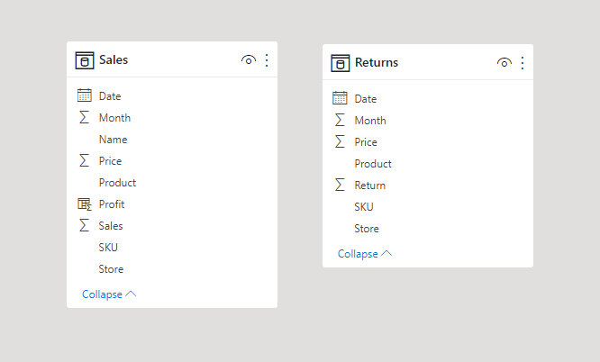

<h1> Case Study Sales Report </h1>

<h2>Introduction</h2>

In this project, I will perform the creation of dashboards, so the retailer can visualize the current sales data in different parameters based on their database. To do this we need tools such as Excel and Power BI.

<h2>Scenario</h2>

Y Electronics has stores over in a few capitals states in Brazil. This way is essential to keep track of their sales, products, returns, and profits. They're looking for improvements in their sales reports, moving from static reports to visual dashboards.

<h2>Business Request</h2>

- How much Y Electronics sold of what products, and how it has been over the year of 2019.
- Which city has the best sales performance and their volume of sales.
- Measure the rates returns of products.

<h3>Business Demand Overview</h3>

1. Dashboard of stores performance regards total sales.
2. Dashboard that shows profit per month in the whole year of 2019.
3. Dashboard that shows the most sold items.

<h2>Data Transformation</h2>

- The actual data was taken from Kaggle and was extracted by using SQL Server into CSV files to perform their use in Power BI.
- There are two tables used in this project:

1. Sales: This Table has details about the sales history of 2019, such as Product, Profit, Sales, Price of Items, Date, Store, and Clients Names.

2. Returns: This table is focused on the return of items. Contain most returned Products, Date, Store and Price.

<h3>Data Model</h3>

You can see in this image the data model used in Power BI after the data was extracted

<h3>Visualization</h3>

The final product is a dashboard that contains all the business demands. The map shows us the performance of each store across the country, followed by the total profit of 2019 and the most sold item in their stores.

You can see the final dashboard clicking [HERE](https://app.powerbi.com/groups/me/reports/6dab6f93-82d5-4671-b0de-d9c346c0472c?ctid=f498c83b-f0d1-4000-9acf-332090bd7cb3&pbi_source=linkShare) or in the image below.

<h2>Conclusion</h2>

- The most sold product was the iPhone with almost 9k units sold. Making for the company R$ 47 million.
- The most returned item was the Smartwatch with 395 units, followed by Tablets with 301 units refunded.
- The store located in São Paulo was the best regarding performance-wise with R$ 10.5 million, followed by the Rio store that made it R$ 7.6 million in profit.
